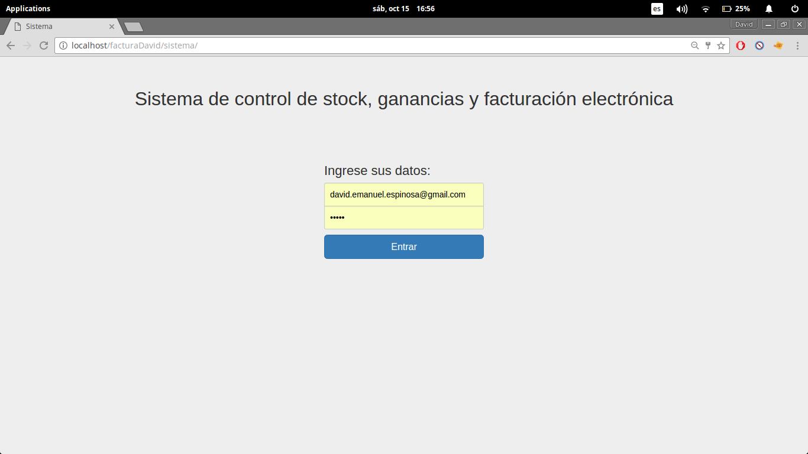
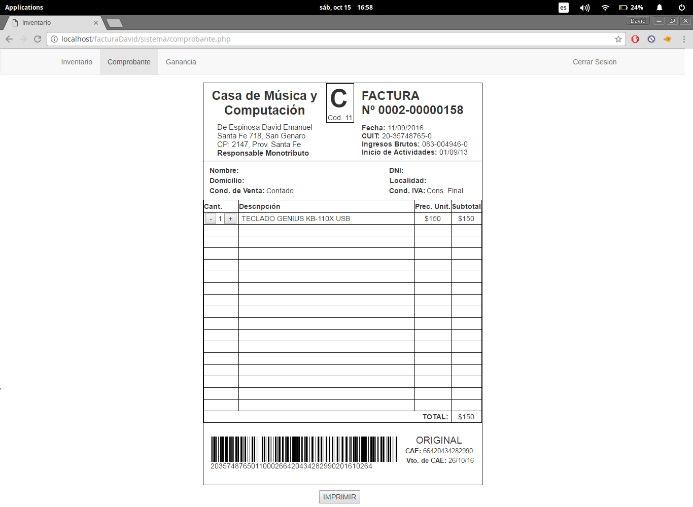
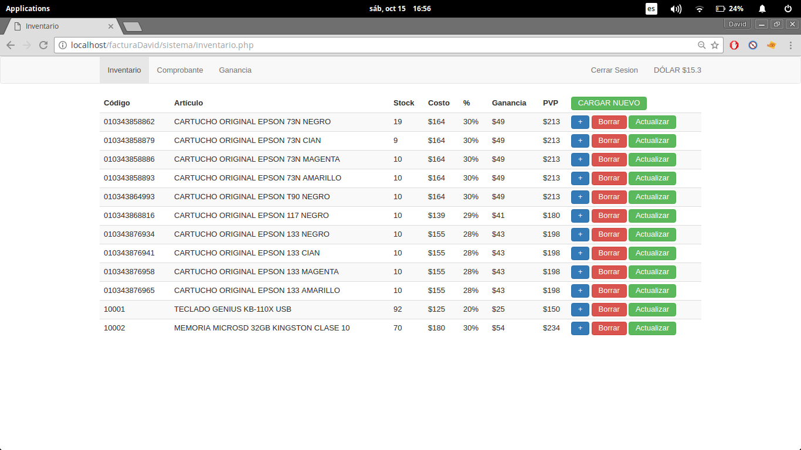
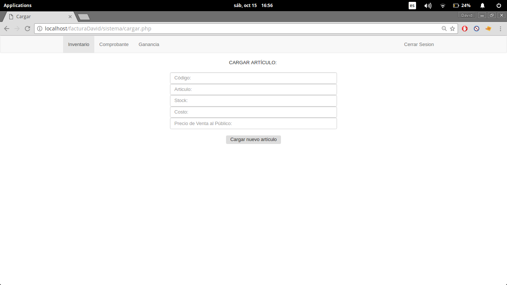
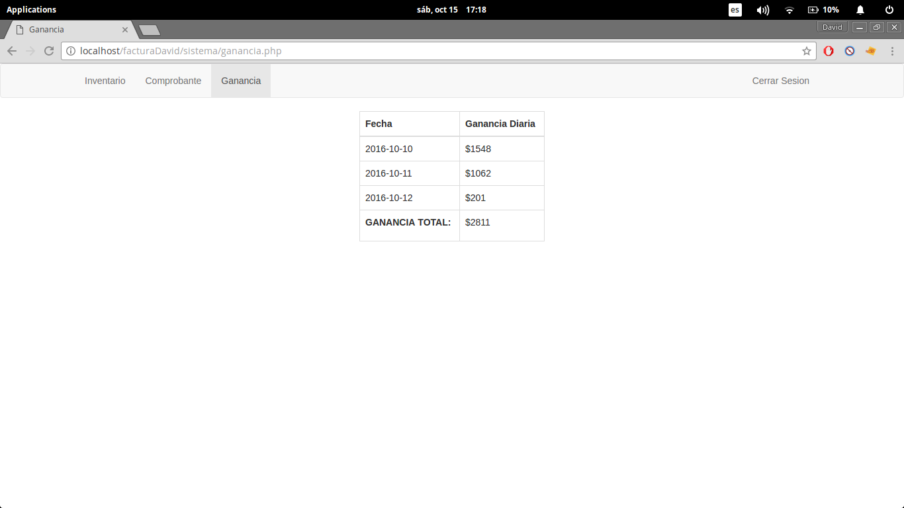

Este es el trabajo final que desarrollé para el curso de Programación de Aplicaciones Web utilizando PHP y MySQL de Empleartec, cursado en el Polo Tecnológico de Rosario.
http://www.empleartec.org.ar/cursos/388/programacion-php

El mismo es un sistema de control de stock, ganancia y facturación electrónica, esta pensado como para ser utilizado por un solo usuario en un comercio o pequeña empresa familiar.

Para la parte de comunicación con los Webservices de la AFIP utilicé el codigo escrito por Guillermo O. Freschi, sacado de esta página: https://bitbucket.org/tordek/afiphp/src/e209aac44e04?at=factura_electronica

El código que escribi yo esta en la carpeta "sistema".

Sistema probado únicamente sobre GNU/Linux, con Google Chrome y Xampp 5.6

-----------------------

Documentación original:
Como usar esto
==============

> ## Notas para XAMPP:
>
> Necesitás una versión con PHP 5.6. Si te tira error de "array constant in class", es esto.
>
> Habilitá 'php_soap.dll' en 'php.ini'. Si te dice que no está la clase SoapClient, es esto:
>
> 1. Abrí la configuración de 'php.ini' [Paso 1](http://imgur.com/yLLXuWK).
> 2. Borrá el ';' al principio de la linea 'extension=php_soap.dll' [Paso 2](http://i.imgur.com/4v6kNRf.png).

## Para sacar los certificados:

Leé la [documentación de la AFIP]( http://www.afip.gob.ar/ws/) y [mi aclaracíon](https://groups.google.com/forum/#!msg/php-arg/3Us0OfEtopw/FjIQZ1D_HGAJ). (Ignorar lo de proxy). O mirá [este video](https://www.youtube.com/watch?v=ietDXvUzVIQ) de Mariano Reingart.

Edita configs.php. Tenés que poner: path al archivo de certificado, path y key del keyfile (Ojo que va con "file://"), y tu CUIT.

Para pasar de homologacion a producción hay que hacer el cambio de lineas comentadas en 3 archivos: 
-comprobante.php
-WSAAAuth.php
-FacturaElectronica.php